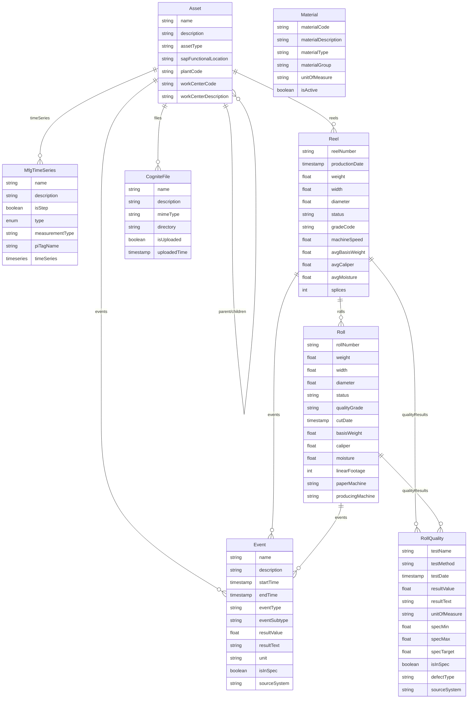
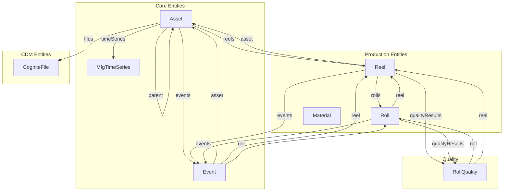
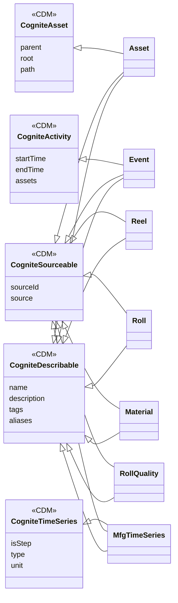

# Appendix: sylvamo_mfg_core Data Model

> **Status:** Draft for Discussion  
> **Last Updated:** January 31, 2026  
> **Space:** sylvamo_mfg_core_schema  
> **Instance Space:** sylvamo_mfg_core_instances

This appendix documents the `sylvamo_mfg_core` data model, which extends the Cognite Data Model (CDM) with manufacturing-specific entities for paper production.

---

## Entity Relationship Diagram



---

## Relationship Flowchart



---

## CDM Inheritance Diagram



---

## Entity Summary

| Entity | Implements | Custom Container | Key Relationships |
|--------|------------|------------------|-------------------|
| **Asset** | CogniteAsset, CogniteDescribable, CogniteSourceable | MfgAsset | parent/children (hierarchy), timeSeries, reels, events, files |
| **MfgTimeSeries** | CogniteTimeSeries, CogniteDescribable, CogniteSourceable | MfgTimeSeries | assets, timeSeries (CDF link) |
| **Event** | CogniteActivity, CogniteDescribable, CogniteSourceable | MfgEvent | asset, reel, roll |
| **Reel** | CogniteDescribable, CogniteSourceable | MfgReel | asset, rolls, events, qualityResults |
| **Roll** | CogniteDescribable, CogniteSourceable | MfgRoll | reel, events, qualityResults |
| **Material** | CogniteDescribable, CogniteSourceable | Material | (standalone) |
| **RollQuality** | CogniteDescribable, CogniteSourceable | RollQuality | roll, reel |
| **CogniteFile** | CogniteDescribable, CogniteSourceable | (CDM) | assets |

---

## Key Design Decisions

1. **CDM Integration**: All entities implement CDM interfaces (CogniteDescribable, CogniteSourceable) for consistency
2. **Asset Hierarchy**: Uses CogniteAsset for parent/children relationships with SAP functional locations
3. **Event Unification**: Single Event entity for all event types (lab tests, quality inspections, downtime, work orders)
4. **Reel/Roll Model**: ISA-95 aligned - Reel as Batch, Roll as MaterialLot
5. **Time Series Link**: MfgTimeSeries uses `timeseries` property type for CDF preview/sparkline functionality

---

## Current Data Statistics

| Entity | Count | Source |
|--------|-------|--------|
| Asset | 44,898 | SAP Asset Hierarchy |
| MfgTimeSeries | 3,532 | PI Server |
| Event | 92,000+ | SAP, Proficy, Fabric |
| Reel | 83,600+ | Fabric PPR |
| Roll | 1,000+ | Fabric PPR |
| CogniteFile | 97 | SharePoint |
| Material | TBD | SAP |
| RollQuality | TBD | SharePoint |

---

## GraphQL Query Example

```graphql
{
  listAsset(first: 10) {
    items {
      externalId
      name
      assetType
      sapFunctionalLocation
      parent {
        externalId
        name
      }
      children {
        items {
          externalId
          name
        }
      }
      events {
        items {
          externalId
          eventType
          startTime
        }
      }
    }
  }
}
```

---

> **Note:** This is a working document for discussion purposes. The model may evolve based on feedback.
