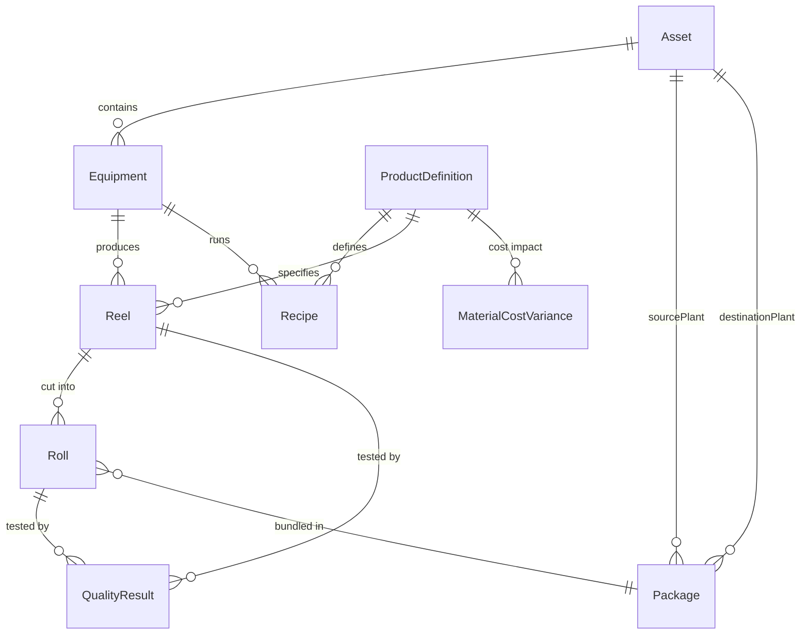

# Data Model Walkthrough: Tracing Paper Production

**A practical example explaining how data flows through the Sylvamo Manufacturing Data Model**

---

## Interactive Entity Diagram

Click any entity to jump to its detailed explanation:

| Entity | Description | Jump To |
|--------|-------------|---------|
| **Asset** | Mills and facilities | [→ Asset Details](#asset) |
| **Equipment** | Paper machines, winders, sheeters | [→ Equipment Details](#equipment) |
| **ProductDefinition** | Paper grades and specifications | [→ ProductDefinition Details](#productdefinition) |
| **Recipe** | ISA-88 production recipes | [→ Recipe Details](#recipe) |
| **Reel** | Paper reels (batches) | [→ Reel Details](#reel) |
| **Roll** | Cut rolls (sellable units) | [→ Roll Details](#roll) |
| **Package** | Inter-plant transfer bundles | [→ Package Details](#package) |
| **QualityResult** | Quality test measurements | [→ QualityResult Details](#qualityresult) |
| **MaterialCostVariance** | Cost and PPV tracking | [→ MaterialCostVariance Details](#materialcostvariance) |



---

## The Scenario

**Eastover Mill** produces **20lb Bond Paper** that gets shipped to **Sumpter Facility** for sheeting and distribution. This walkthrough traces a paper order from production to delivery.

---

## Asset

Mills and facilities that contain production equipment.

| Property | Type | Description |
|----------|------|-------------|
| name | Text | Asset name (e.g., "Eastover Mill") |
| description | Text | Asset description |
| assetType | Text | Mill, Facility, Warehouse |

**Example:** Eastover Mill is Sylvamo's primary paper production facility.

---

## Equipment

Production equipment within an asset. [↑ Back to diagram](#interactive-entity-diagram)

| Property | Type | Description |
|----------|------|-------------|
| name | Text | Equipment name |
| equipmentType | Text | PaperMachine, Winder, Sheeter |
| asset | Relation → Asset | Parent facility |

The model starts with the physical hierarchy: mills contain equipment.

```
┌─────────────────────────────────────────────────────────────┐
│  Asset: "Eastover Mill"                                     │
│  └── Equipment: "Paper Machine 1 (PM1)" ──── produces reels │
│  └── Equipment: "Winder 1 (EMW01)" ───────── cuts into rolls│
│                                                             │
│  Asset: "Sumpter Facility"                                  │
│  └── Equipment: "Sheeter 1" ──────────────── sheets rolls   │
└─────────────────────────────────────────────────────────────┘
```

**Sample Data:**

| Entity | External ID | Name | Relation |
|--------|-------------|------|----------|
| Asset | `asset:eastover` | Eastover Mill | — |
| Asset | `asset:sumpter` | Sumpter Facility | — |
| Equipment | `equip:pm1` | Paper Machine 1 (PM1) | asset → Eastover Mill |
| Equipment | `equip:winder1` | Winder 1 | asset → Eastover Mill |

---

## ProductDefinition

Paper grade specifications. [↑ Back to diagram](#interactive-entity-diagram)

| Property | Type | Description |
|----------|------|-------------|
| productId | Text | Product identifier |
| name | Text | Product name (e.g., "Wove Paper 20lb") |
| basisWeight | Float | Basis weight in lb/3000 sq ft |

---

## Recipe

ISA-88 production recipes that define how to make products on equipment. [↑ Back to diagram](#interactive-entity-diagram)

| Property | Type | Description |
|----------|------|-------------|
| recipeId | Text | Recipe identifier |
| name | Text | Recipe name |
| recipeType | Text | general, site, master, control |
| targetParameters | JSON | Target quality parameters |
| productDefinition | Relation | Product this recipe makes |
| equipment | Relation | Equipment this recipe runs on |

Products define what we make. Recipes define how to make them on specific equipment.

```
ProductDefinition: "Wove Paper 20lb"
    │
    ├── Recipe: "Bond 20lb Master Recipe for PM1"
    │       ├── productDefinition → Wove Paper 20lb
    │       ├── equipment → PM1
    │       └── targetParameters: { basisWeight: 20.0, moisture: 4.5% }
    │
    └── Used to produce reels on PM1
```

**Sample Data:**

| Entity | Name | Key Properties |
|--------|------|----------------|
| ProductDefinition | Wove Paper 20lb | basisWeight: 20.0, brightness: 92 |
| Recipe | Bond 20lb Master for PM1 | recipeType: "master", targetParameters: `{basisWeight: 20, moisture: 4.5}` |

**ISA-88 Recipe Types:**
- `general` - Site-independent formula
- `site` - Adapted for a specific site  
- `master` - Equipment-specific recipe
- `control` - Single batch execution

---

## Reel

Paper reels produced by equipment (ISA-95 Batch). [↑ Back to diagram](#interactive-entity-diagram)

| Property | Type | Description |
|----------|------|-------------|
| reelNumber | Text | Reel identifier |
| productionDate | Timestamp | When produced |
| productDefinition | Relation | Paper grade |
| equipment | Relation | Machine that produced it |

---

## Roll

Cut rolls from reels (ISA-95 MaterialLot - sellable unit). [↑ Back to diagram](#interactive-entity-diagram)

| Property | Type | Description |
|----------|------|-------------|
| rollNumber | Text | Roll identifier |
| width | Float | Roll width in inches |
| reel | Relation | Source reel |
| package | Relation | Package bundled in |

Equipment produces reels (batches). Reels are cut into rolls (sellable units).

```
PM1 produces Reel EM0010110008 on Jan 15, 2026
    │
    ├── productDefinition → Wove Paper 20lb
    ├── equipment → PM1
    ├── weight: 2,500 kg
    │
    └── Winder cuts reel into 4 rolls:
            ├── Roll EME13B08061N (width: 8.5")
            ├── Roll EME13B08062N (width: 8.5")
            ├── Roll EME13B08063N (width: 8.5")
            └── Roll EME13B08064N (width: 8.5")
```

**Sample Data:**

| Entity | ID | Key Relations |
|--------|----|---------------|
| Reel | EM0010110008 | productDefinition → Wove Paper 20lb, equipment → PM1 |
| Roll | EME13B08061N | reel → EM0010110008 |
| Roll | EME13B08062N | reel → EM0010110008 |
| Roll | EME13B08063N | reel → EM0010110008 |
| Roll | EME13B08064N | reel → EM0010110008 |

**ISA-95 Mapping:**
- **Reel** = ISA-95 Batch (production run)
- **Roll** = ISA-95 MaterialLot (sellable/trackable unit)

---

## QualityResult

Quality test measurements on reels and rolls. [↑ Back to diagram](#interactive-entity-diagram)

| Property | Type | Description |
|----------|------|-------------|
| testName | Text | Test name (Caliper, Moisture, etc.) |
| resultValue | Float | Numeric result |
| isInSpec | Boolean | Pass/fail flag |
| reel | Relation | Tested reel |
| roll | Relation | Tested roll |

Quality tests are performed on reels and rolls, with results compared against specifications.

```
QualityResult tests on Reel EM0010110008:
    ├── Caliper Test:    4.05 mils (target: 4.00) ✅ Pass
    ├── Moisture Test:   4.8% (target: 4.5%)      ✅ Pass
    ├── Basis Weight:    20.2 lb (target: 20.0)   ✅ Pass
    └── Brightness:      92.5% (target: 92.0)     ✅ Pass
```

**Sample Data:**

| Test | Result | Target | Spec Min | Spec Max | isInSpec | reel |
|------|--------|--------|----------|----------|----------|------|
| Caliper | 4.05 | 4.00 | 3.8 | 4.2 | ✅ true | EM0010110008 |
| Moisture | 4.8 | 4.5 | 4.0 | 5.0 | ✅ true | EM0010110008 |
| Basis Weight | 20.2 | 20.0 | 19.5 | 20.5 | ✅ true | EM0010110008 |
| Brightness | 92.5 | 92.0 | 90.0 | 94.0 | ✅ true | EM0010110008 |

---

## Package

Inter-plant transfer bundles containing rolls. [↑ Back to diagram](#interactive-entity-diagram)

| Property | Type | Description |
|----------|------|-------------|
| packageNumber | Text | Package identifier |
| status | Text | Created, Shipped, InTransit, Received |
| sourcePlant | Relation → Asset | Origin facility |
| destinationPlant | Relation → Asset | Destination facility |

Rolls are bundled into packages for inter-plant transfer.

```
Package EME12G04152F:
    ├── Contains: 4 rolls from Reel EM0010110008
    ├── sourcePlant → Eastover Mill
    ├── destinationPlant → Sumpter Facility
    ├── status: "Shipped"
    └── shippedDate: 2026-01-16
```

**Sample Data:**

| Entity | ID | Key Relations |
|--------|----|---------------|
| Package | EME12G04152F | sourcePlant → Eastover, destinationPlant → Sumpter |
| Roll | EME13B08061N | reel → EM0010110008, package → EME12G04152F |
| Roll | EME13B08062N | reel → EM0010110008, package → EME12G04152F |
| Roll | EME13B08063N | reel → EM0010110008, package → EME12G04152F |
| Roll | EME13B08064N | reel → EM0010110008, package → EME12G04152F |

**Package Status Flow:**
`Created` → `Shipped` → `InTransit` → `Received`

---

## MaterialCostVariance

Purchase price variance (PPV) tracking for raw materials. [↑ Back to diagram](#interactive-entity-diagram)

| Property | Type | Description |
|----------|------|-------------|
| material | Text | Material number |
| materialType | Text | FIBR, RAWM, PKNG, PRD1 |
| currentPPV | Float | Current period PPV |
| priorPPV | Float | Prior period PPV |
| ppvChange | Float | Period-over-period change |
| productDefinition | Relation | Linked product |

Track purchase price variance (PPV) for raw materials linked to products.

```
MaterialCostVariance for raw materials used in Wove Paper 20lb:
    │
    ├── WOOD, SOFTWOOD (FIBR)
    │       currentPPV: -$72,630.80 (favorable - below standard cost)
    │       productDefinition → Wove Paper 20lb
    │
    └── CAUSTIC SODA (RAWM)
            currentPPV: -$22,095.06 (favorable)
            productDefinition → Wove Paper 20lb
```

**Sample Data:**

| Material | Description | Type | Current PPV | Prior PPV | Change |
|----------|-------------|------|-------------|-----------|--------|
| 000005210009 | WOOD, SOFTWOOD | FIBR | -$72,630.80 | -$65,000.00 | -$7,630.80 |
| 000001019900 | CAUSTIC SODA | RAWM | -$22,095.06 | -$20,000.00 | -$2,095.06 |

**PPV Interpretation:**
- **Negative PPV** = Favorable (actual cost < standard cost)
- **Positive PPV** = Unfavorable (actual cost > standard cost)

---

## Complete Traceability Query

This GraphQL query traces the complete journey of a roll:

```graphql
{
  # Find a specific roll
  getRoll(externalId: "roll:EME13B08061N") {
    rollNumber
    width
    
    # What reel was it cut from?
    reel {
      reelNumber
      productionDate
      
      # What product grade?
      productDefinition {
        name
        basisWeight
      }
      
      # What machine made it?
      equipment {
        name
        asset { name }  # Which mill?
      }
    }
    
    # What package is it in?
    package {
      packageNumber
      status
      sourcePlant { name }       # Shipped from?
      destinationPlant { name }  # Shipped to?
    }
  }
}
```

**Result:**
```json
{
  "rollNumber": "EME13B08061N",
  "width": 8.5,
  "reel": {
    "reelNumber": "EM0010110008",
    "productionDate": "2026-01-15",
    "productDefinition": {
      "name": "Wove Paper 20lb",
      "basisWeight": 20.0
    },
    "equipment": {
      "name": "Paper Machine 1 (PM1)",
      "asset": { "name": "Eastover Mill" }
    }
  },
  "package": {
    "packageNumber": "EME12G04152F",
    "status": "Shipped",
    "sourcePlant": { "name": "Eastover Mill" },
    "destinationPlant": { "name": "Sumpter Facility" }
  }
}
```

---

## Visual Summary

```
┌──────────────┐     ┌──────────────┐     ┌──────────────┐
│ Eastover Mill│────►│   PM1        │────►│ Reel         │
│   (Asset)    │     │ (Equipment)  │     │ EM0010110008 │
└──────────────┘     └──────────────┘     └──────┬───────┘
                                                 │ cut into
                            ┌────────────────────┼────────────────────┐
                            ▼                    ▼                    ▼
                     ┌──────────────┐     ┌──────────────┐     ┌──────────────┐
                     │ Roll 061N    │     │ Roll 062N    │     │ Roll 063N    │
                     └──────┬───────┘     └──────┬───────┘     └──────┬───────┘
                            │                    │                    │
                            └────────────────────┼────────────────────┘
                                                 │ bundled in
                                                 ▼
                                          ┌──────────────┐
                                          │ Package      │
                                          │ EME12G04152F │
                                          └──────┬───────┘
                                                 │
                              ┌──────────────────┴──────────────────┐
                              ▼                                     ▼
                       ┌──────────────┐                      ┌──────────────┐
                       │ Eastover Mill│                      │Sumpter Facil.│
                       │ (sourcePlant)│                      │(destination) │
                       └──────────────┘                      └──────────────┘
```

---

## Key Relationships Summary

| From | Relation | To | Business Meaning |
|------|----------|----| -----------------|
| Equipment | asset | Asset | Equipment belongs to a mill |
| Recipe | productDefinition | ProductDefinition | Recipe makes a product |
| Recipe | equipment | Equipment | Recipe runs on equipment |
| Reel | productDefinition | ProductDefinition | Reel is a batch of product |
| Reel | equipment | Equipment | Reel made on equipment |
| Roll | reel | Reel | Roll cut from reel |
| Roll | package | Package | Roll bundled in package |
| Package | sourcePlant | Asset | Package ships from mill |
| Package | destinationPlant | Asset | Package ships to facility |
| QualityResult | reel | Reel | Quality test on reel |
| QualityResult | roll | Roll | Quality test on roll |
| MaterialCostVariance | productDefinition | ProductDefinition | Cost impacts product |

---

*This walkthrough uses real data from Sylvamo's production systems.*
